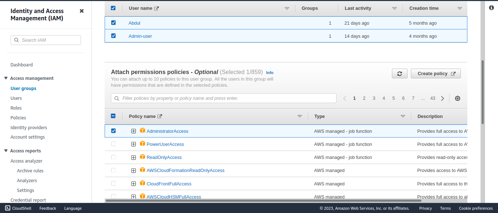
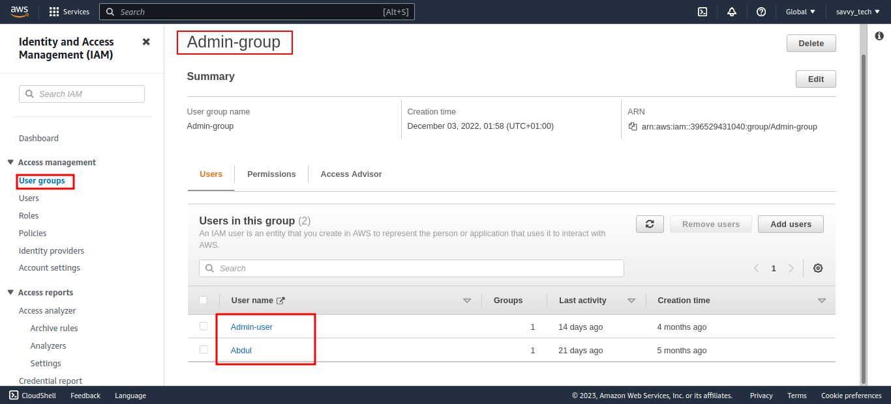
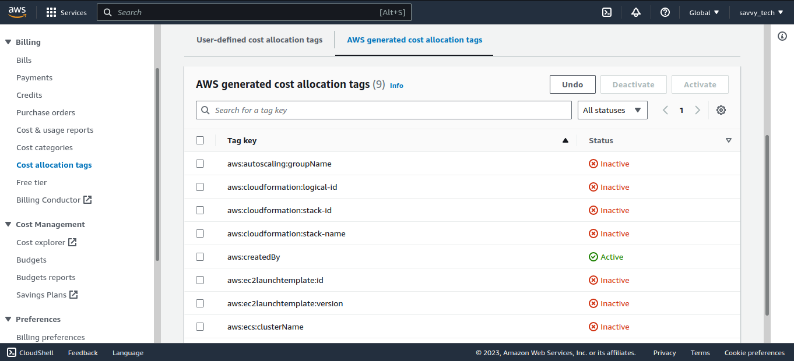
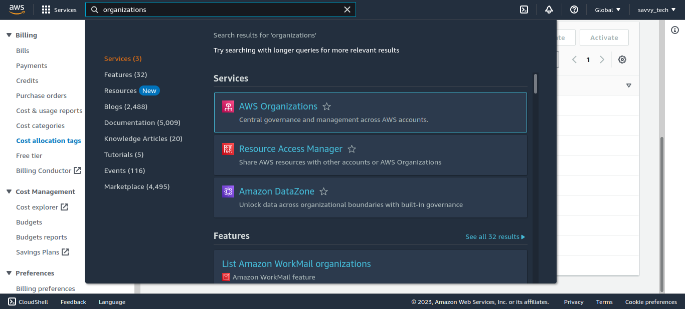
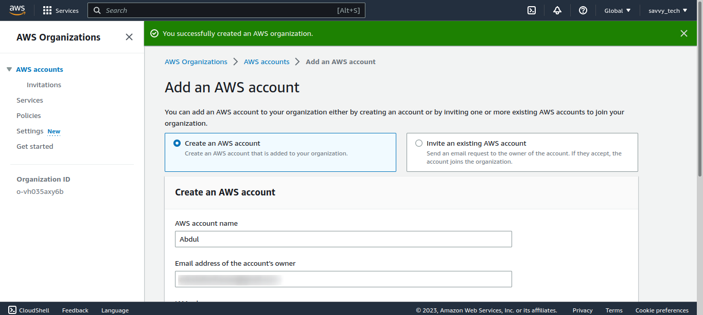
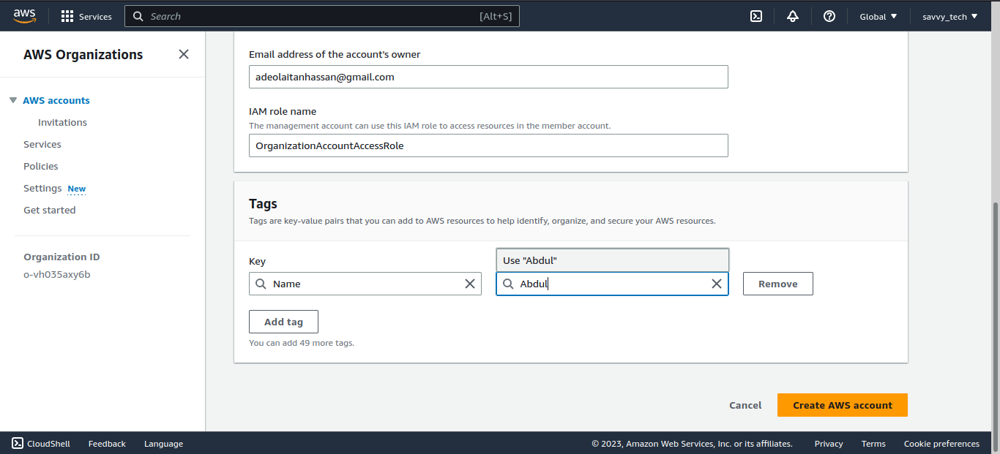
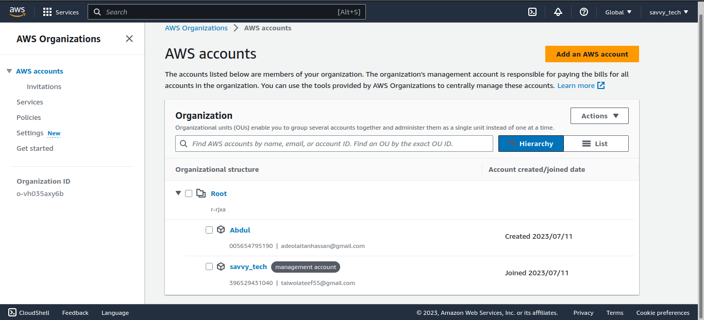

 The 12-weeks workshop challenge is inspired by Prasad Rao ( LinkedIn Link - https://www.linkedin.com/feed/update/urn:li:activity:7044291636020834304/)

------
------
## Week-1 Overview
In the Week 1 Challenge, we will go through the below topics.

* Basic Modules
In this basic modules, you can learn various functions of each AWS foundational service.

Basic modules consist of the following agenda:

 * Compute - Amazon EC2
 * Network - Amazon VPC
 * Security - AWS IAM
 * Monitoring - Amazon CloudWatch
 * Database - Amazon RDS
 * Storage - Amazon S3, Amazon Elastic File System
 * Provision - AWS CloudFormation

Through each hands on lab, let's find out the characteristics of each service.

--------
________

### Cost - Monitoring and Observability

* Introduction to Cost Management
* Create IAM Users and Groups
* Enable Billing Alarms and Cost Allocation Tags
* Setup AWS Organizations
* Create Cloud Resources
* Setup AWS Cost Management Tools

### Introduction to Cost Management

In this section, we will walkthrough the foundational tools that need to be setup for efficient cost monitoring. We will showcase foundational topics like AWS Organizations, Cost Allocation Tags, Billing and various cost management tools. We will conclude the walkthrough with a recommendation tool for rightsizing, savings plans, and reserved instances.
Cost Intelligence Dashboards

Do you know how much you’re spending per hour on AWS Lambda? How much you are saving with Reserved Instances and Savings Plan? Does your team know how much their application costs to run on AWS? Visualizing and understanding your cost and usage data is critical for a good cloud financial management and accountability.

Cloud Financial Management (CFM) is the practice of bringing financial accountability to the variable spend model of cloud. CFM practitioners are pursuing business efficiency across all of their accounts by first visualizing their cost and usage, then setting goals, and finally driving accountability from their IT teams to meet or exceed these goals.

This lab will walk you through implementing a series of dashboards for all of your AWS accounts that will help you drive financial accountability, optimize cost, track usage goals, implement best-practices for governance, and achieve operational excellence.
Start the workshop

* Create IAM Users and Groups
I create a two users and also created a group, then I granted the group the Administrator full access role, thus this two users will have admin acess to all aws services.

---------
_________
### Enable Billing Alarmss
1. Begin by searching for `Billing`
in the search bar, and select the Billing Service

2. Select Billing Preferences in the left-hand menu.

3. Verify that the checkbox to Receive Billing Alerts is selected. (Note: This setting allows us to configure billing alerts based on specific metrics.)

4. Select the Save Preferences button to save the updated settings, then continue on to Cost Allocation Tagging in the next step.

### Enable Cost Allocation Tags

1. Select Cost Allocation Tags on the left-hand menu. There are two types of Cost Allocation Tags: User-Defined (manual user-created tags) and AWS-Created (created automatically by AWS when resource is created).

2. Navigate to the AWS generated cost allocation tags tab, select aws-createdBy, and select Activate. (Note: This enables tracking of resources by the tag generated by AWS during their creation.)

-------
_______
###  Setup AWS Organizations

AWS Organizations helps you centrally manage and govern your environment as you grow and scale your AWS resources. Using AWS Organizations, you can create accounts and allocate resources, group accounts to organize your workflows, apply policies for governance, and simplify billing by using a single payment method for all of your accounts. AWS Organizations is integrated with other AWS services so you can define central configurations, security mechanisms, audit requirements, and resource sharing across accounts in your organization. AWS Organizations is available to all AWS customers at no additional charge.

1. Search `Organizations` in the search bar at the top of the page.

2. Select  `Create an organization`.
   Note: Once the organization is generated, a verification email will be sent to the AWS account email on file. This email needs to be verified before an account can be added to the organization.

3. Select Add an AWS Account

4. Select Create a new account. (There are two ways to add an account to an AWS Organization, create a new account or add an existing account. If the root account has not been added to an Organization yet, the option to add it will also be available.)
 
5. Enter AWS account name: CostOpAcct

Email: (account owner email address)
IAM Role: Default
Tag Key: Name
Tag Value: CostOp
Select the Create AWS account button to complete setup.

6. The Services tab allows a user to give trust access to services to be used across the organization.

7. The Policies tab allows a user to specify policies that need to be maintained across the organization.