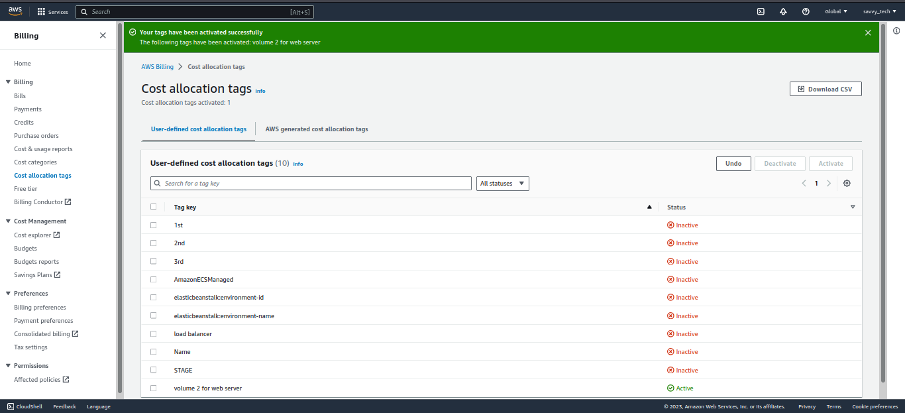
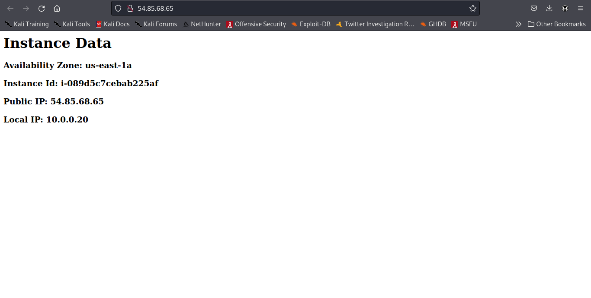
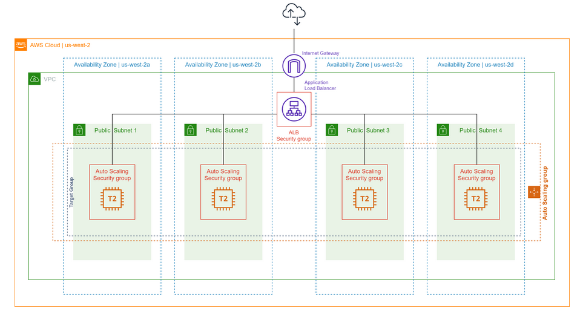
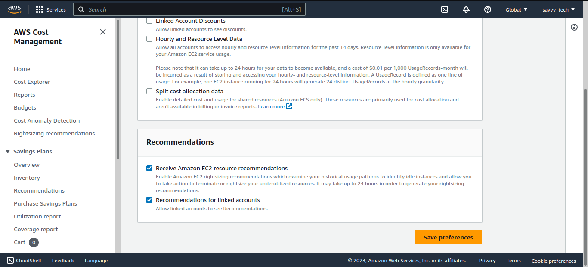

## Week-1 Overview
In Week 1 Challenge, we will go through the below topics.

* Basic Modules
In this basic modules, you can learn various functions of each AWS foundational service.

Basic modules consist of the following agenda:

 * Compute - Amazon EC2
 * Network - Amazon VPC
 * Security - AWS IAM
 * Monitoring - Amazon CloudWatch
 * Database - Amazon RDS
 * Storage - Amazon S3, Amazon Elastic File System
 * Provision - AWS CloudFormation

--------
________

### Cost - Monitoring and Observability

* Introduction to Cost Management
* Create IAM Users and Groups
* Enable Billing Alarms and Cost Allocation Tags
* Setup AWS Organizations
* Create Cloud Resources
* Setup AWS Cost Management Tools

### Introduction to Cost Management

In this section, we will walkthrough the foundational tools that need to be setup for efficient cost monitoring. We will showcase foundational topics like AWS Organizations, Cost Allocation Tags, Billing and various cost management tools. We will conclude the walkthrough with a recommendation tool for rightsizing, savings plans, and reserved instances.
Cost Intelligence Dashboards

Do you know how much you’re spending per hour on AWS Lambda? How much you are saving with Reserved Instances and Savings Plan? Does your team know how much their application costs to run on AWS? Visualizing and understanding your cost and usage data is critical for a good cloud financial management and accountability.

Cloud Financial Management (CFM) is the practice of bringing financial accountability to the variable spend model of cloud. CFM practitioners are pursuing business efficiency across all of their accounts by first visualizing their cost and usage, then setting goals, and finally driving accountability from their IT teams to meet or exceed these goals.

This lab will walk you through implementing a series of dashboards for all of your AWS accounts that will help you drive financial accountability, optimize cost, track usage goals, implement best-practices for governance, and achieve operational excellence.
Start the workshop

* Create IAM Users and Groups
I create a two users and also created a group, then I granted the group the Administrator full access role, thus this two users will have admin acess to all aws services.

---------
_________
### Enable Billing Alarmss
1. Begin by searching for `Billing`
in the search bar, and select the Billing Service

2. Select Billing Preferences in the left-hand menu.

3. Verify that the checkbox to Receive Billing Alerts is selected. (Note: This setting allows us to configure billing alerts based on specific metrics.)

4. Select the Save Preferences button to save the updated settings, then continue on to Cost Allocation Tagging in the next step.

### Enable Cost Allocation Tags

1. Select Cost Allocation Tags on the left-hand menu. There are two types of Cost Allocation Tags: User-Defined (manual user-created tags) and AWS-Created (created automatically by AWS when resource is created).

2. Navigate to the AWS generated cost allocation tags tab, select aws-createdBy, and select Activate. (Note: This enables tracking of resources by the tag generated by AWS during their creation.)

-------
_______
###  Setup AWS Organizations

AWS Organizations helps you centrally manage and govern your environment as you grow and scale your AWS resources. Using AWS Organizations, you can create accounts and allocate resources, group accounts to organize your workflows, apply policies for governance, and simplify billing by using a single payment method for all of your accounts. AWS Organizations is integrated with other AWS services so you can define central configurations, security mechanisms, audit requirements, and resource sharing across accounts in your organization. AWS Organizations is available to all AWS customers at no additional charge.

1. Search `Organizations` in the search bar at the top of the page.

2. Select  `Create an organization`.
   Note: Once the organization is generated, a verification email will be sent to the AWS account email on file. This email needs to be verified before an account can be added to the organization.

3. Select Add an AWS Account

4. Select Create a new account. (There are two ways to add an account to an AWS Organization, create a new account or add an existing account. If the root account has not been added to an Organization yet, the option to add it will also be available.)
 
5. Enter AWS account name: CostOpAcct

Email: (account owner email address)
IAM Role: Default
Tag Key: Name
Tag Value: CostOp
Select the Create AWS account button to complete setup.

6. The Services tab allows a user to give trust access to services to be used across the organization.
  Note: AWS recommends that you do not enable trusted access with an AWS service on this page. Instead, use the service’s console to enable and disable trusted access with AWS Organizations. This allows the other service to perform any supporting tasks needed to enable or disable access with Organizations. For more information, see the documentation for the AWS service you want to use. 

 

7. The Policies tab allows a user to specify policies that need to be maintained across the organization.

8. The Settings tab provides a summary of the details of the organization, administrators delegated to manage the services or organization, and the ability to delete the organization.

9. Up Next, we will start creating cloud resources.

----------
__________
### Create Cloud Resources
The next step in the process is to create a resource to monitor billing and usage details. This workshop includes 2 options to create resources, the first will be done by using the AWS console [Create EC2 Instance with the AWS Console (Option 1)](https://catalog.workshops.aws/general-immersionday/en-US/basic-modules/70-cost/introduction-to-cost-management/step-4#create-ec2-instance-with-the-aws-console-(option-1)). The second option is to create an EC2 instance using AWS CloudFormation. The CloudFormation EC2 instance will host an apache server that displays a webpage containing the EC2 instance details when viewed via a web browser. 
Note: I added a third option, which is creating and launching an EC2 instance using terraform.

### Create EC2 Instance with AWS CloudFormation (Option 2)

1. To begin, save the following template (FinalTemplate.yml) from the s3 bucket here 

2. Navigate to the CloudFormation service page  and select Create Stack

 

3. Verify that Template is ready is selected, and select Upload a template file.

4. Select the Choose File button. Select final_template.yml file that was downloaded in the first step. Select Next.

5. For the stack details type,
 
        Stack Name: MyStack
        Instance Type: T3.micro
        Select Next.
   
6. Add a tag with the following values:

        Key: Name
        Value: CostOp
        Select Next
        Select Submit to deploy the EC2 instance.
    
    

    

7. We notice that cloud formation starts deployinf the stack, including vpcs, subnets, internet gateways, security group etc. After few minutes, we can acess the website from the public ip address of any of the EC2 instances
    

   
------
______

### Create EC2 Instance with Terraform (Option 3)
* Install required software and tools
    * Install Terraform.
    * Install AWS CLI.
    * Configure aws cli to be used in Terraform.

### Important Terraform commands.

1. terraform init: This command is used for initialize the terraform.

2. terraform fmt: This command is used for format the terraform code.

3. terraform validate: This command is used for validate the terraform code.

4. terraform plan: This command is used to describe the plan. This is highly recommended to run before apply the changes.

5. terraform show: Show the current state or a saved plan

6. terraform apply: If you are statisfy with changes, run this command to apply the changes.

* Now, Create a directory for terraform deployment. I named mine, `Demo web-server tf`. Change directory into the folder using `cd` command 

Step 3:  Create a Key pair.

        terraform {
        required_providers {
            aws = {
            source  = "hashicorp/aws"
            version = "~> 3.5.0"
            }
        }
        }

        # Configure the AWS Provider
        provider "aws" {
        region = "eu-west-2"
        }

        # Create a Key pair

        resource "aws_key_pair" "abdul-aws-key-pair" {
        key_name   = "abdul-aws-key-pair"
        public_key = tls_private_key.rsa.public_key_openssh
        }

        # RSA key of size 4096 bits
        resource "tls_private_key" "rsa" {
        algorithm = "RSA"
        rsa_bits  = 4096
        }

        # Create a local file
        resource "local_file" "abdul-aws-key-pair" {
        content  = tls_private_key.rsa.private_key_pem
        filename = "abdul-aws-key-pair"
        }

We used the terraform code above to create a key pair. 

Step 2: Create our Webserver (EC2 instance)

We will do the below steps in this lab.

   * Create an EC2 instance.
   * Bootstap Apache/PHP webserver.
   * Install basic web page
   * Configure security group so that we can access it via internet.

To make the code from terraform, create template file called userdata.tpl in the same folder where your main.tf is stored. This is basically a bash script that installs lamp stack on the server EC2 instance

  

`userdata.tpl`

    #!/bin/sh

    # Install a LAMP stack
    amazon-linux-extras install -y lamp-mariadb10.2-php7.2 php7.2
    yum -y install httpd php-mbstring

    # Start the web server
    chkconfig httpd on
    systemctl start httpd

    # Install the web pages for our lab
    if [ ! -f /var/www/html/immersion-day-app-php7.tar.gz ]; then
    cd /var/www/html
    wget https://aws-joozero.s3.ap-northeast-2.amazonaws.com/immersion-day-app-php7.tar.gz  
    tar xvfz immersion-day-app-php7.tar.gz
    fi

    # Install the AWS SDK for PHP
    if [ ! -f /var/www/html/aws.zip ]; then
    cd /var/www/html
    mkdir vendor
    cd vendor
    wget https://docs.aws.amazon.com/aws-sdk-php/v3/download/aws.zip
    unzip aws.zip
    fi

    # Update existing packages
    yum -y update

* Type `terraform plan` 

* Type `terraform apply`

Step 3: Creating a Launch Template

We will use below terraform code for creating a launch template. I am updating my terraform `main.tf`, so you will get the final one in the code folder.

    resource "aws_launch_template" "aws-launch-template" {
    name = "aws-launch-template"
    image_id = data.aws_ami.amazon-linux-2.id
    instance_type = "t2.micro"
    key_name = aws_key_pair.abdul-aws-key-pair.key_name
    vpc_security_group_ids = [aws_security_group.aws-sg-webserver.id]
    tag_specifications {
        resource_type = "instance"
        tags = {
        Name = "aws-webserver-demo"
        }
    }
    user_data = file("userdata.tpl")
    }

   `Launch Template`
  

Step 4: Setup an Auto Scaling Group

we set the desired capacity to two (2) and if the traffic increases, the number of EC2 instances will increase to 3.

    resource "aws_autoscaling_group" "aws-autoscaling-group" {
    availability_zones = ["eu-west-2a","eu-west-2b","eu-west-2c"]
    desired_capacity   = 2
    max_size           = 3
    min_size           = 2

    launch_template {
        id      = aws_launch_template.aws-launch-template.id
        version = "$Latest"
    }
    }

`Auto-scaling-Groups`
   
   
Now, the terraform code main.tf is as below:

    terraform {
    required_providers {
        aws = {
        source  = "hashicorp/aws"
        version = "~> 3.5.0"
        }
    }
    }

    # Configure the AWS Provider
    provider "aws" {
    region = "eu-west-2"
    }

    # Create a Key pair

    resource "aws_key_pair" "abdul-aws-key-pair" {
    key_name   = "abdul-aws-key-pair"
    public_key = tls_private_key.rsa.public_key_openssh
    }

    # RSA key of size 4096 bits
    resource "tls_private_key" "rsa" {
    algorithm = "RSA"
    rsa_bits  = 4096
    }

    # Create a local file
    resource "local_file" "abdul-aws-key-pair" {
    content  = tls_private_key.rsa.private_key_pem
    filename = "abdul-aws-key-pair"
    }

    # Get latest Amazon Linux 2 AMI
    data "aws_ami" "amazon-linux-2" {
    most_recent = true
    owners      = ["amazon"]
    filter {
        name   = "name"
        values = ["amzn2-ami-hvm*"]
    }
    }

    # Define the security group for the EC2 Instance
    resource "aws_security_group" "aws-sg-webserver" {
    name        = "aws-sg-webserver"
    description = "Allow incoming connections"
    vpc_id      = aws_default_vpc.default.id
    ingress {
        from_port   = 80
        to_port     = 80
        protocol    = "tcp"
        cidr_blocks = ["0.0.0.0/0"]
        description = "Allow incoming HTTP connections"
    }
    ingress {
        from_port   = 22
        to_port     = 22
        protocol    = "tcp"
        cidr_blocks = ["0.0.0.0/0"]
        description = "Allow incoming SSH connections (Linux)"
    }
    egress {
        from_port   = 0
        to_port     = 0
        protocol    = "-1"
        cidr_blocks = ["0.0.0.0/0"]
    }
    tags = {
        Name = "Webserver-sg"
    }
    }
    resource "aws_default_vpc" "default" {

    }

    /*
    resource "aws_instance" "vm-server" {
    ami                    = data.aws_ami.amazon-linux-2.id
    instance_type          = "t2.micro"
    vpc_security_group_ids = [aws_security_group.aws-sg-webserver.id]
    key_name               = aws_key_pair.abdul-aws-key-pair.key_name
    user_data              = file("userdata.tpl")

    tags = {
        Name = "aws-webserver-demo"
    }
    }
    */

    resource "aws_launch_template" "aws-launch-template" {
    name                   = "aws-launch-template"
    image_id               = data.aws_ami.amazon-linux-2.id
    instance_type          = "t2.micro"
    key_name               = aws_key_pair.abdul-aws-key-pair.key_name
    vpc_security_group_ids = [aws_security_group.aws-sg-webserver.id]
    tag_specifications {
        resource_type = "instance"
        tags = {
        Name = "aws-webserver-demo"
        }
    }
    user_data = filebase64("userdata.tpl")
    }

    resource "aws_autoscaling_group" "aws-autoscaling-group" {
    availability_zones = ["eu-west-2a", "eu-west-2b", "eu-west-2c"]
    desired_capacity   = 2
    max_size           = 3
    min_size           = 2

    launch_template {
        id      = aws_launch_template.aws-launch-template.id
        version = "$Latest"
    }
    }

* Now, Type the following commands
    
    `terraform plan`

  

* Type `terraform apply`,
    type yes when the prompt to enter a value

 Great!!!. You have successfully provisioned the EC2 instance with autoscaling groups in 3 availability zones (eu-west-2a, eu-west-2b, eu-west-2c).

 

* You can view the website by typing the public ip-address of any one of the two ec2 instances on a web browser.

* Type `terraform destroy` to destroy (clean-up) all the resources created by terraform,

### Architectural diagram for EC2 Autoscaling
Below is a sample diagram for EC2 autoscaling downloaded from [AWS page workshop]( https://catalog.workshops.aws/general-immersionday/en-US/basic-modules/10-ec2/ec2-auto-scaling/ec2-auto-scaling/2-ec2-as)

---------
_________
### Setup AWS Cost Management Tools

The Cost Management Console provides useful tools to help gather information related to cost and usage, analyze cost drivers and usage trends, take actions to budget spending, identify cost anomalies, and purchase savings plans.

### Setup AWS Cost Explorer

This section will setup the Cost Explorer tool that is used for generating cost reports and performing the cost analysis for resource consumption.

1. Select AWS Cost Management page here 
. Note: The dashboard displays a graph showing the current cost and usage metrics, and can be filtered using the Report parameters located on the right side.

2. Select Preferences from the menu on the left side of the AWS Cost Management Console.

3. Select Receive Amazon EC2 Resource Recommendations to receive rightsizing recommendations for EC2 instances, and select the Save Preferences button.
  

### Setup AWS Budgets

This section will setup the AWS Budgets tool that is used to monitor spending and create notifications when amounts go past the set pricing limit.

### Setup AWS Anomaly Detection

This section will setup the AWS Anomaly Detection tool that leverages advanced Machine Learning technologies to identify anomalous spend and root causes, to quickly take action.

### Optimize Resources

This section will setup cost reporting, cost-saving opportunities by rightsizing EC2 resources, and provide sign-up for savings plans or reserved instances.

### Next: Clean Up all resources created to avoid unnecessary costs